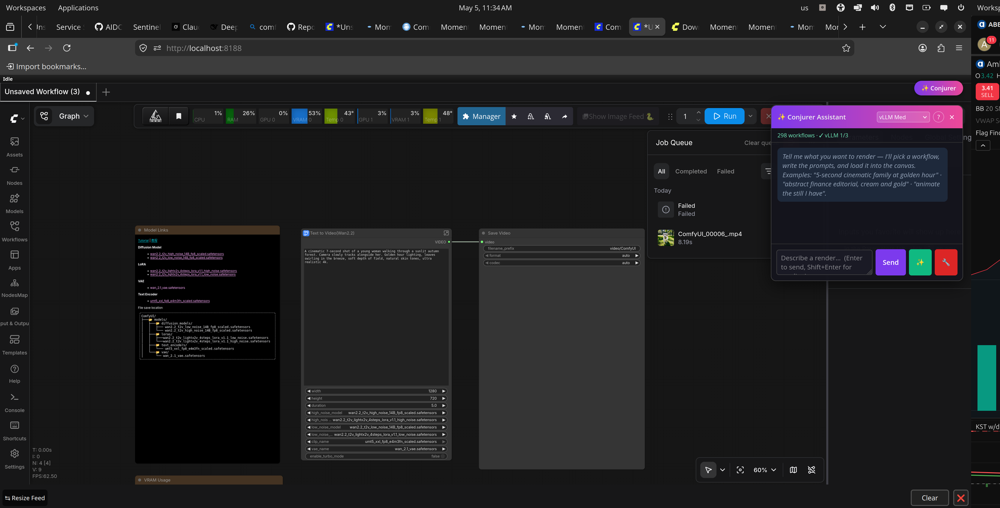
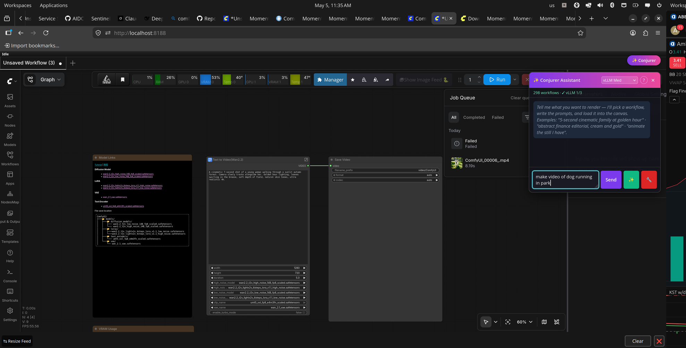
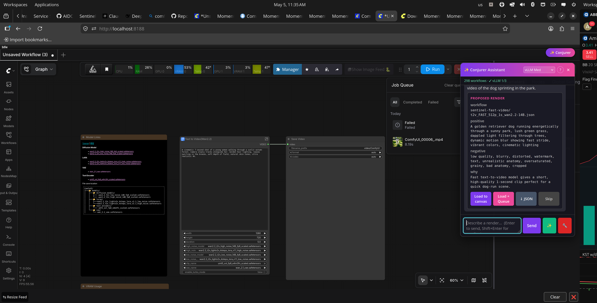
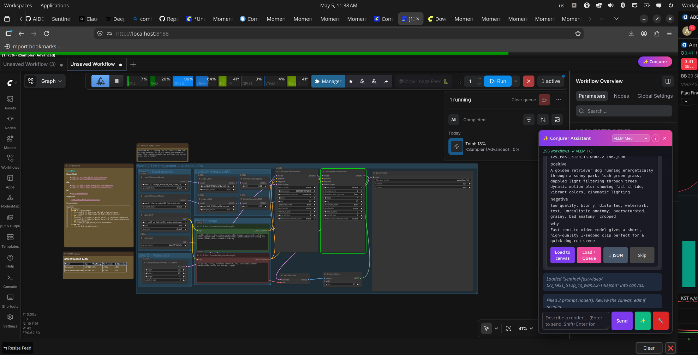
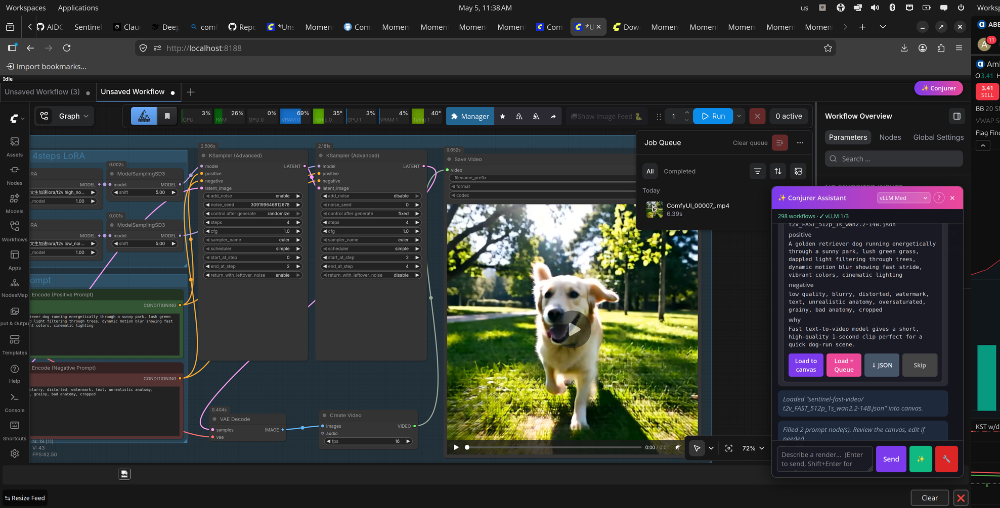

# Conjurer

A chat assistant that lives **inside ComfyUI's web UI**. Talk to it in plain
English; it picks the right workflow, writes the prompts, loads the graph
onto your canvas, fills in the prompt nodes, and (optionally) queues the
render.

Like ComfyUI-Copilot, but: **free, self-hosted, no MCP server required**, and
works with any LLM — your local vLLM tiers, Ollama, LM Studio, or any cloud
API (DeepSeek, OpenAI, Anthropic, Grok, etc.).

> ⭐ **If Conjurer saves you time, please star this repo** — that's the only
> currency we accept. The whole project is free and stays free.

## See it in action

> *"make video of dog running in park"* → 30 seconds later, you have a video.

| Step | What happens |
|---|---|
|  | **1.** Click the **✨ Conjurer** button (top-right) — the chat panel slides in. Status banner shows you have 298 workflows + which LLMs are reachable. |
|  | **2.** Type a description in plain English — *"make video of dog running in park"* — and hit Send. |
|  | **3.** Conjurer picks the right workflow (`t2v_FAST_512p_1s_wan2.2-14B`), writes positive + negative prompts, explains *why* it picked that one. **Load to canvas**, **Load + Queue**, or **↓ JSON**. |
|  | **4.** Workflow drops onto your canvas with prompts auto-filled. Queue starts — progress bar runs along the top. |
|  | **5.** Done. Inline video preview right in the canvas. The whole flow took ~30 seconds end-to-end. |

## What it does

- **Render** — *"5 second cinematic family at golden hour"* → picks a video
  workflow, writes the prompts, loads it on the canvas, ready to queue.
- **Generate from scratch** ✨ — describe the workflow you want, the LLM
  composes a new graph using the live `/object_info` schema, validates
  every node, fills in defaults you forgot.
- **Debug** 🔧 — click after a failed render. Captures the broken graph
  + last error, returns root cause + 1-3 specific fixes.
- **Ask** — *"what does CLIPTextEncode do?"* / *"find me a workflow for
  face swap"* / *"how do I make a person dance from a reference video?"*
- **Auto-catalog** — scans your workflows recursively, groups by category
  (photo / video / edit / upscale / dance / etc.) so the LLM picks
  correctly even with hundreds of workflows.

## Install

### Option 1 — ComfyUI Manager (recommended, all platforms)

1. Open ComfyUI Manager.
2. Search for **Conjurer**.
3. Click **Install**.
4. Restart ComfyUI.

(Coming once we publish to <https://registry.comfy.org/>.)

### Option 2 — Manual install

#### Linux / macOS

```bash
git clone https://github.com/ai-xcode/conjurer ~/conjurer
python3 ~/conjurer/install.py
cp ~/conjurer/.env.example ~/conjurer/.env
chmod 600 ~/conjurer/.env
nano ~/conjurer/.env       # paste your DeepSeek key (or any other supported provider)
# Restart ComfyUI; click ✨ Conjurer in the top-right.
```

#### Windows (PowerShell)

```powershell
git clone https://github.com/ai-xcode/conjurer $HOME\conjurer
python $HOME\conjurer\install.py
copy $HOME\conjurer\.env.example $HOME\conjurer\.env
notepad $HOME\conjurer\.env    # paste your API key
# Restart ComfyUI; click ✨ Conjurer in the top-right.
```

> **Windows note:** symlinks need either Developer Mode (Settings → Privacy &
> Security → For Developers) OR run `install.py` as Administrator. If neither
> works, run `python install.py --copy-mode` — the project is copied instead
> of symlinked (slower to update, but always works).

The installer:
- auto-detects ComfyUI (override with `--comfyui /path/to/ComfyUI`),
- symlinks (or junctions, or copies) the project into `<ComfyUI>/custom_nodes/conjurer`,
- copies 5 starter workflows into `<ComfyUI>/user/default/workflows/conjurer-starter/`,
- installs `requirements.txt` deps into ComfyUI's venv if one exists.

To uninstall: `python install.py --uninstall`.

## Configure

Edit `~/conjurer/.env` (already `chmod 600`). At least one of:

```bash
DEEPSEEK_API_KEY=sk-...                           # cloud, ~$0.004 / request
VLLM_BASE_URL=http://127.0.0.1:8001/v1            # local vLLM
LMSTUDIO_BASE_URL=http://127.0.0.1:1234/v1        # local LM Studio
OLLAMA_HOST=http://127.0.0.1:11434                # local Ollama
OPENAI_API_KEY=sk-...
ANTHROPIC_API_KEY=sk-ant-...
GROQ_API_KEY=gsk_...                              # fast cloud
XAI_API_KEY=xai-...                               # Grok (more permissive)
OPENROUTER_API_KEY=sk-or-v1-...                   # gateway to ~250 models
GEMINI_API_KEY=...
```

The provider dropdown in the chat panel picks which one is used per request.

## Pricing — what's free, what's not

| Tier | What it is | Cost to you |
|---|---|---|
| **Conjurer (this repo, v1.0)** | Local extension. Runs on your machine. | **Free forever.** Bring your own LLM (any local model: $0; or any cloud key, you pay the provider per request). |
| **Conjurer Cloud (future, planned)** | Optional hosted MCP server with curated workflow library + RAG. Free 50-call trial per user, then BYO key. | **Trial: free.** After trial: $0 if you supply your own LLM key; small subscription only if you want us to host the LLM too. |

**Right now (v1.0): Conjurer Cloud is not running yet.** Everything you see
runs entirely on your machine. There's no hosted server collecting your
queries. Your prompts go directly from your browser to whatever LLM provider
you configured in `.env` over HTTPS.

We'll announce when Cloud opens for trials. ⭐ the repo to get notified.

## Security — your API key never leaves your machine (today)

- `.env` is `chmod 600` (owner-read-only) and listed in `.gitignore`. Never
  bundled into commits or releases.
- The `/conjurer/status` endpoint returns only `deepseek_key: true|false` — it
  does **not** expose the value of any key.
- Outbound LLM calls go directly from your machine to the provider's API over
  HTTPS. **Conjurer is not a relay; there is no Conjurer server in between.**
- `comfy_out/`, `logs/`, `pids/`, `venv/`, `__pycache__/` are gitignored.

If you fork:

```bash
git status                    # .env should NOT appear
git check-ignore -v .env      # should print: ".gitignore:1:.env  .env"
```

## Layout

| Path | Purpose |
|---|---|
| `__init__.py` | ComfyUI custom_node entry — registers routes + WEB_DIRECTORY |
| `server.py` | HTTP routes (`/conjurer/status`, `/conjurer/chat`, `/conjurer/generate`, `/conjurer/debug-graph`, `/conjurer/workflow`, `/conjurer/nodes`) |
| `web/conjurer.js` | Chat panel injected into ComfyUI's UI (toggle via ✨ Conjurer button) |
| `llm_client.py` | Provider abstraction (vLLM / Ollama / DeepSeek / Anthropic / OpenAI / Grok / etc.) |
| `install.py` | Cross-platform installer (Linux/macOS/Windows) |
| `pyproject.toml` | Package metadata for ComfyUI Registry |
| `.env.example` | Template — copy to `.env` |
| `workflows/starter/` | 5 minimal generic workflows bundled with the install |

## How the integration works

When you click "Load to canvas" or "Load + Queue":

1. The panel calls `/conjurer/workflow?path=<filename>` to fetch the JSON.
2. ComfyUI's own JS API `app.loadGraphData(json)` deserialises and draws it.
3. Two `CLIPTextEncode` nodes are auto-filled with the LLM's positive +
   negative prompts.
4. If you chose "Load + Queue", `app.queuePrompt()` runs — same path as
   ComfyUI's own "Queue Prompt" button. Format conversion (UI → API) is done
   by ComfyUI itself, so you never hit the *"resave as API"* error.

The **✨ Generate** button skips the catalog and asks the LLM to compose a
new graph using `/object_info` as the node schema, with 2-3 in-context
examples and validation against the live ComfyUI before returning.

## Roadmap

- [x] **v1.0** — Local extension. Pick / Generate / Debug / Q&A. Free.
- [ ] **v1.1** — RAG over your local workflow library (better picks at scale).
- [ ] **v2.0** — Conjurer Cloud (optional hosted MCP). 50 free calls per user
      using shared key, then BYO. Workflow library auto-grows from
      community contributions.

## Contributing

PRs welcome. Workflow contributions especially welcome — drop new starter
workflows into `workflows/starter/` and open a PR. They'll ship with the
next release.

## License

MIT — do whatever, just don't sue me.
